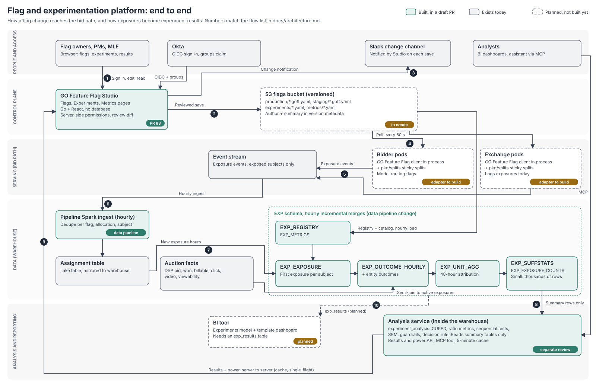

# Architecture: flags and experimentation end to end

This page shows how the pieces fit together: how a flag change reaches the bid path, and how
exposures turn into experiment results. The requirements and priorities behind it are in
[flag_migration_plan.md](../flag_migration_plan.md).

Legend: a solid green box is built and in a draft PR. A solid grey box exists today. A dashed
box is planned and not built yet.

## Flows

Each number matches a marker on the diagram.

1. **Sign in, edit, read.** Flag owners, product managers and MLE use GO Feature Flag Studio in
   the browser. Okta signs them in over OIDC, and the groups claim maps to Studio's
   permission rules. Every permission check is server-side and default-deny.
2. **Save.** Every change is shown as a diff first. Studio then writes the file straight to a
   versioned S3 bucket with a conditional request, so a concurrent change to the same flag
   returns a conflict instead of overwriting it. Each version records the author and a
   plain-language summary in its metadata. Only Studio's IAM role can write to the bucket.
3. **Notify.** After each save, Studio posts the summary, environment and author to the Slack
   change channel. Per-team routing comes later.
4. **Evaluate.** Bidder and exchange pods poll the bucket every 60 seconds and evaluate flags in
   process with the GO Feature Flag client and `pkg/splits`. Nothing on the bid path calls
   Studio or a database. `pkg/splits` keeps assignments sticky while an experiment ramps.
5. **Log exposures.** When a subject is exposed to an experiment arm, the service logs an
   exposure event to the event stream. Subjects that pass through a rule are not logged;
   holdout subjects are logged as holdout.
6. **Ingest.** The data pipeline's hourly Spark ingest loads exposures into the assignment
   table. It dedupes on flag, allocation and subject, so impressions that several flags
   evaluate keep every exposure.
7. **Aggregate.** An hourly chain in the warehouse's `EXP` schema loads the experiment registry
   and metric catalog from the bucket, keeps the first exposure per subject, joins only active
   exposures to the auction facts with a 48-hour attribution window, rolls up per unit, and
   writes small summary-statistics tables. Every query is bounded by hour watermarks and
   active experiments.
8. **Analyse.** The analysis service runs inside the warehouse account and reads only the
   summary tables and the registry. It computes:
   - lift and confidence intervals, with CUPED-adjusted and raw readouts;
   - sequential or fixed-horizon tests;
   - sample-ratio checks and guardrails;
   - a roll-out recommendation.

   A results request takes tens of milliseconds and is cached for 5 minutes.
9. **View results.** Studio's backend calls the analysis service's results and power APIs
   server to server, with its own cache and single-flight requests. The browser never talks to
   the analysis service or the warehouse directly.
10. **Explore (planned).** The analysis service will write an `exp_results` table for a BI
    Experiments model and template dashboard. Analysts can already ask for results through the
    analysis service's MCP tool.

## Where state lives

| What | Where | Notes |
| --- | --- | --- |
| Flags and split configuration | YAML in a versioned S3 bucket | Studio is the only writer. Versions keep history, author and summary. |
| What services read | The same bucket, held in memory per pod | Refreshed every 60 seconds; no database on the bid path. |
| Experiment registry and metric catalog | `experiments/*.yaml`, `metrics/*.yaml` in the same bucket | Loaded hourly into `EXP_REGISTRY` and `EXP_METRICS`. |
| Exposures, outcomes, summary statistics | Warehouse `EXP` schema | The only database in the design. |
| Experiment results | Computed on request by the analysis service | In-memory caches in the analysis service and Studio; `exp_results` table planned for BI. |
| Studio sessions | Encrypted browser cookies | Studio has no database. |

## Components and status

| Component | Status | Where |
| --- | --- | --- |
| Studio: flags, experiment splits, Experiments and Metrics pages | Built, draft PR | this repo, PR #3 |
| `pkg/splits` sticky split evaluator | Built, draft PR | this repo, PR #3 |
| S3 backend attribution (author and summary per version) | Built, draft PR | this repo, PR #3 |
| Experiment analysis engine and results API | Built, draft PR, reviewed separately | analysis service repo |
| Assignment dedup fix | Built, draft PR | data pipeline repo |
| `EXP` schema and hourly aggregates | Built, draft PR; grants still needed | data pipeline repo |
| Versioned S3 bucket and Studio write role | Planned | not started |
| Change notifications from Studio | Planned | not started |
| Bidder and exchange adapters | Planned | not started |
| `exp_results` table and BI model | Planned | not started |

## Before production

- **Grants on the `EXP` schema** for the ETL, read-only and analysis-service roles. They are
  listed in the data pipeline change for the data platform team.
- **Real service authentication for the analysis service.** Its routes trust caller-supplied
  identity until the planned SSO integration lands.
- **A warehouse dry run** of the `EXP` SQL. It was checked in DuckDB, which verifies the logic
  but not warehouse-specific syntax.
- **The bucket, Studio's write role, change notifications and the service adapters**
  (flows 2 to 5).
- **The pipeline loader and the analysis service** reading the registry and metric catalog
  directly from the bucket.
